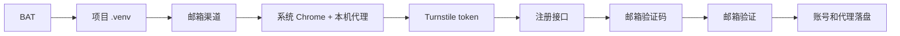

# ProxyScrape 注册链路修复报告

## 结果

2026-07-25 通过 `启动注册.bat` 完成 1 个账号的端到端注册验证：邮箱验证成功，导出 100 个代理节点。账号、密码、访问令牌和代理凭据仅保存在 `.gitignore` 已排除的运行目录中。

| 检查项 | 结果 |
|---|---|
| BAT 使用项目 `.venv` | 通过 |
| GoneBox 创建邮箱 | 通过 |
| Turnstile token | 通过，长度 816 |
| 注册接口 | HTTP 200 |
| 验证邮件投递 | 通过 |
| 邮箱验证 | HTTP 200 |
| 账号记录 | 1 条，`verified=true` |
| 代理导出 | 100 行 |

## 根因与修复

1. BAT 从 `PATH` 命中了缺少 `DrissionPage` 的 Python 环境。新增 `requirements.txt` 和项目 `.venv` 优先级，并在启动前检查依赖。
2. 项目内没有 `turnstilePatch`。代码现在依次检查环境变量、项目目录及相邻工具仓库。
3. HTTP 请求通过 `HTTPS_PROXY` 可达目标，但 Chrome 直连超时。浏览器现在显式继承 `CHROME_PROXY`、`HTTPS_PROXY` 或 `HTTP_PROXY`。
4. DrissionPage 曾选中 Chrome for Testing，且失败页面被误判为表单已填写。代码现在固定优先使用系统 Chrome、独占新标签页，并验证 URL 和表单状态。
5. 自动邮箱每次都从同一渠道开始，导致重复等待未投递邮件。自动顺序调整为 `gonebox → fce_ditpay → fce_areueally`，以本次成功渠道优先。



## 复现

```powershell
python -m venv .venv
.\.venv\Scripts\python.exe -m pip install --index-url https://pypi.org/simple -r requirements.txt
.\启动注册.bat
```

验证时选择 1 个账号、1 个线程、显示或隐藏窗口、GoneBox 或自动邮箱渠道。运行完成后检查：

```powershell
Get-ChildItem account\accounts_*.jsonl | Sort-Object LastWriteTime -Descending | Select-Object -First 1
Get-ChildItem node\proxies_*.txt | Sort-Object LastWriteTime -Descending | Select-Object -First 1
.\.venv\Scripts\python.exe -m unittest test_mail_channels.py -q
```
